# Projeto de Interface

## User Flow

Link para melhor visualização: https://testedevpath.invisionapp.com/freehand/Shelfy-zXAtgSr5S

## Wireframes

Página Inicial, permitindo aos usuários fazer login e navegar sobre as opções da navbar. 
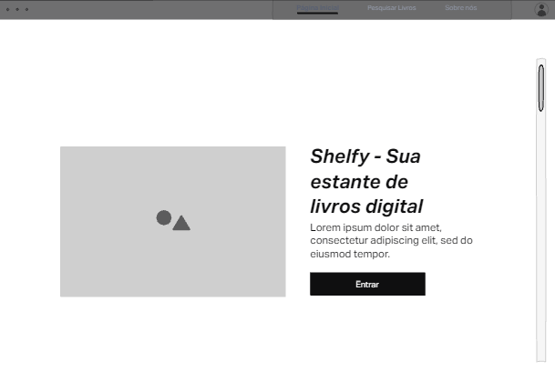

Página para pesquisar livros e receber recomendações
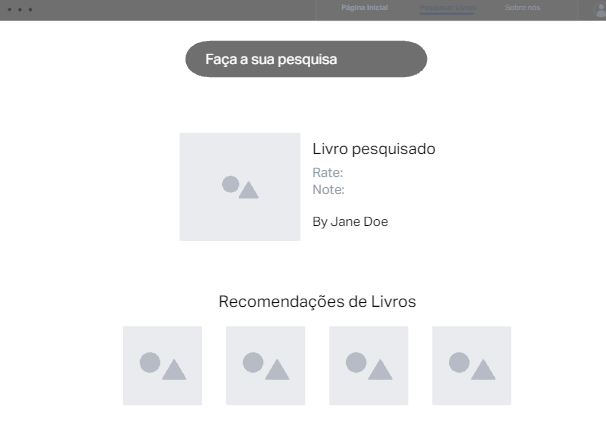

Página de Login
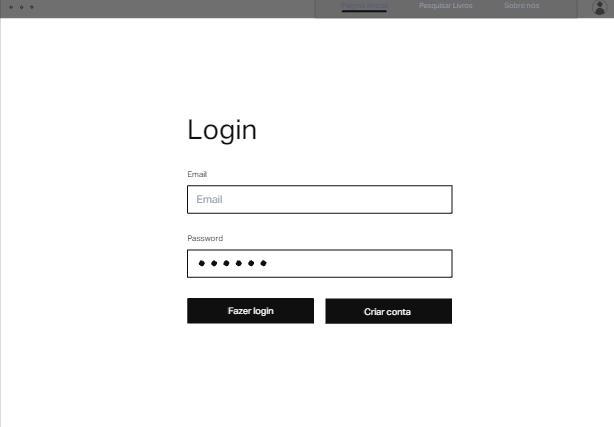

Página de Cadastro
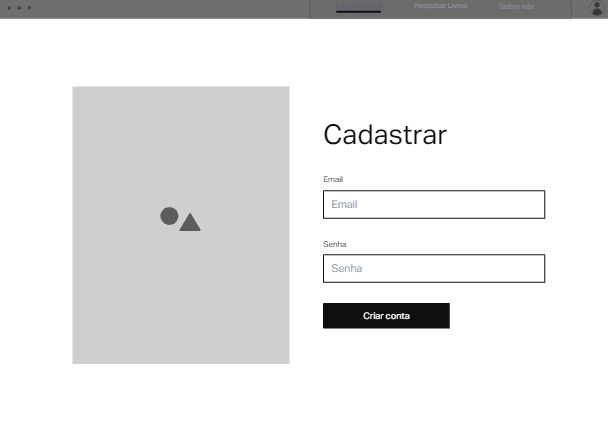

Tela Principal, permitindo aos usuários cadastrar novos livros, estantes e visualizar suas próprias estantes de livros
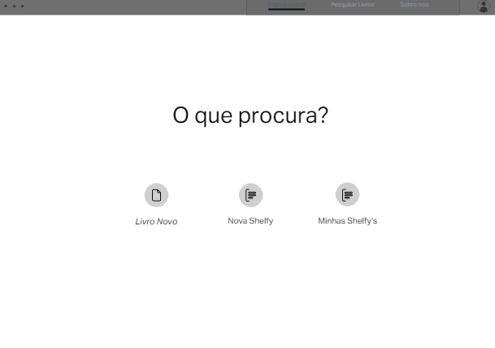

Perfil
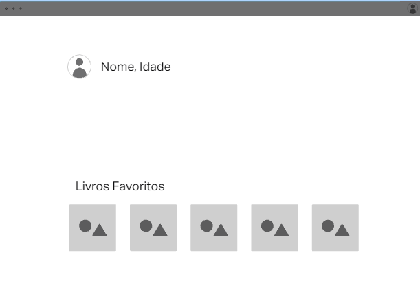

Página para visualizar as estantes de livros criadas
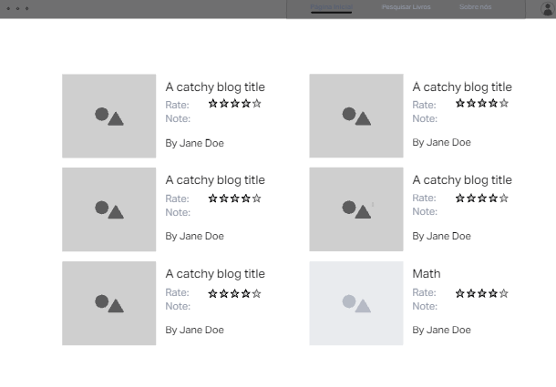

Página para visualizar os livros em cada estante
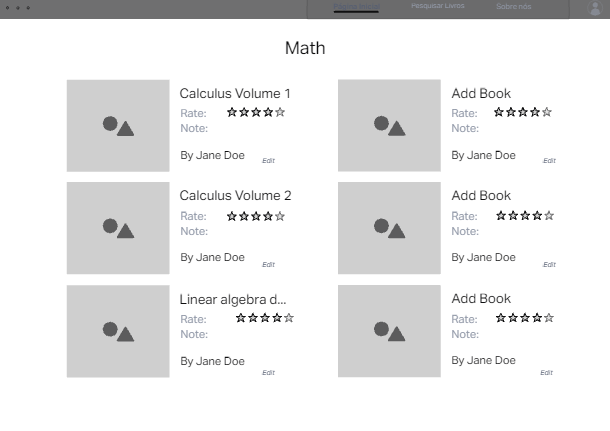

Página para permitir que os usuários avaliem e escrevam resenhas sobre os livros
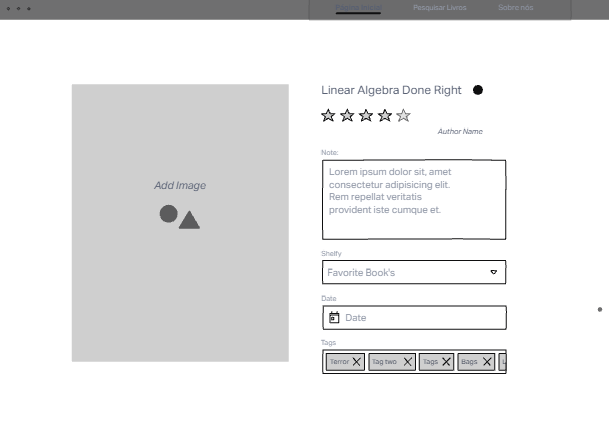

Criar nova estante
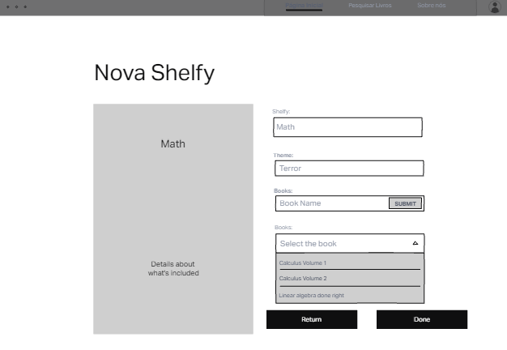

Adicionar novos livros
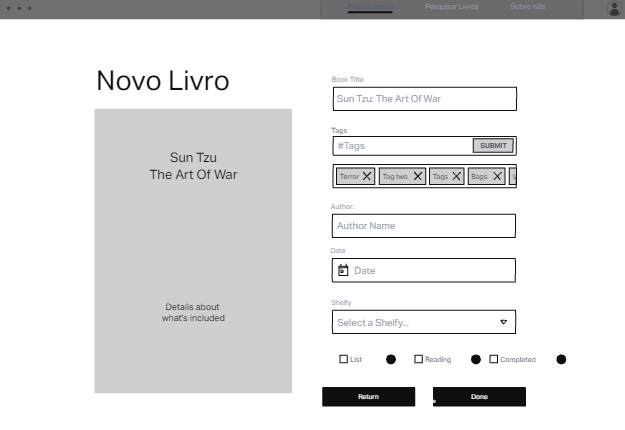

